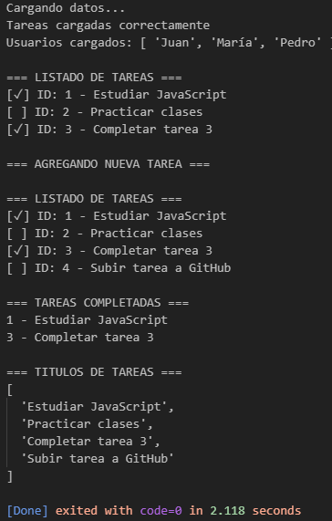

# Javascript Avanzado - Gestor de Tareas

## Descripción

Proyecto desarrollado para practicar conceptos avanzados de JavaScript:

- Clases y objetos.
- Métodos de arrays.
- Promesas.
- Async/Await.
- Simulación de asincronía.
- Promise.all.

## Objetivos

Implementar un sistema simple de gestión de tareas utilizando programación orientada a objetos y programación asíncrona.

## Funcionalidades

- Crear tareas.
- Listar tareas.
- Filtrar tareas completadas.
- Simular carga de datos asincrónica.
- Obtener títulos mediante map.
- Ejecutar operaciones paralelas mediante Promise.all.

## Instalación

1. Clonar el repositorio:

```bash
git clone https://github.com/DanteLopez17/Tarea-3.git
```

2. Ingresar al directorio:

```bash
Ejecutar index.js
```

## Estructura

```text
proyecto/
│
├── index.js
├── README.md
└── assets/
    └── consola.png

```

## Capturas de pantalla



## Autor

**Dante Lopez**

Curso: Curso de Desarrollo en React JS

Módulo 1 - Unidad 3
